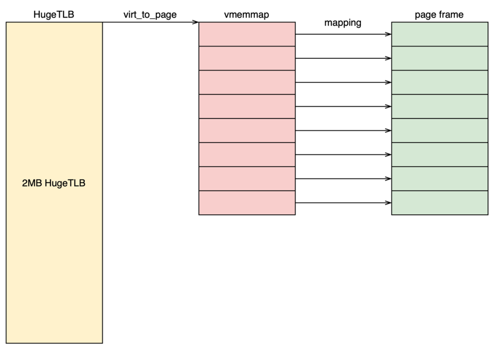
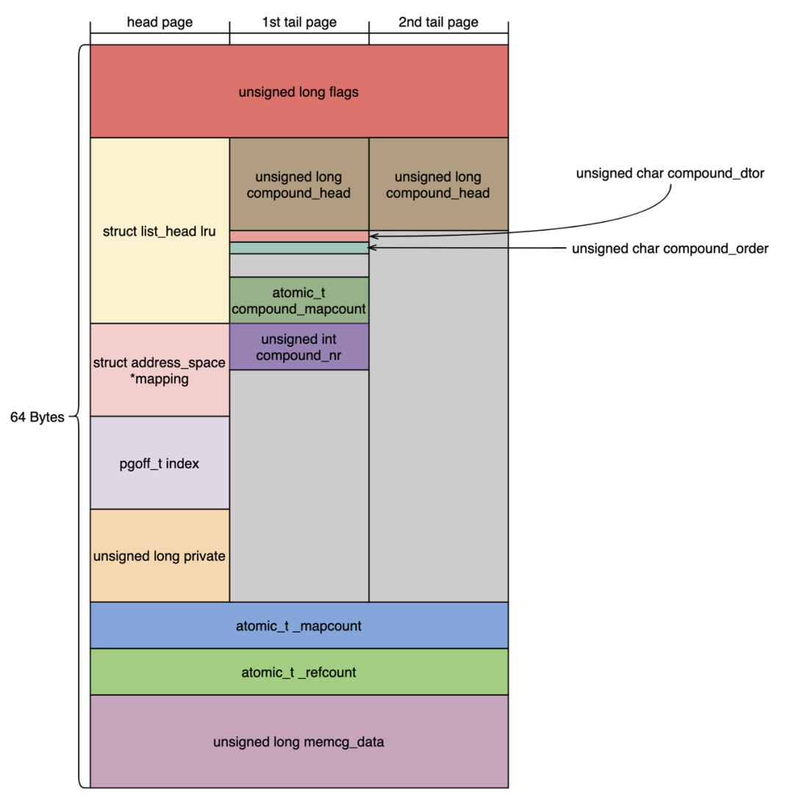
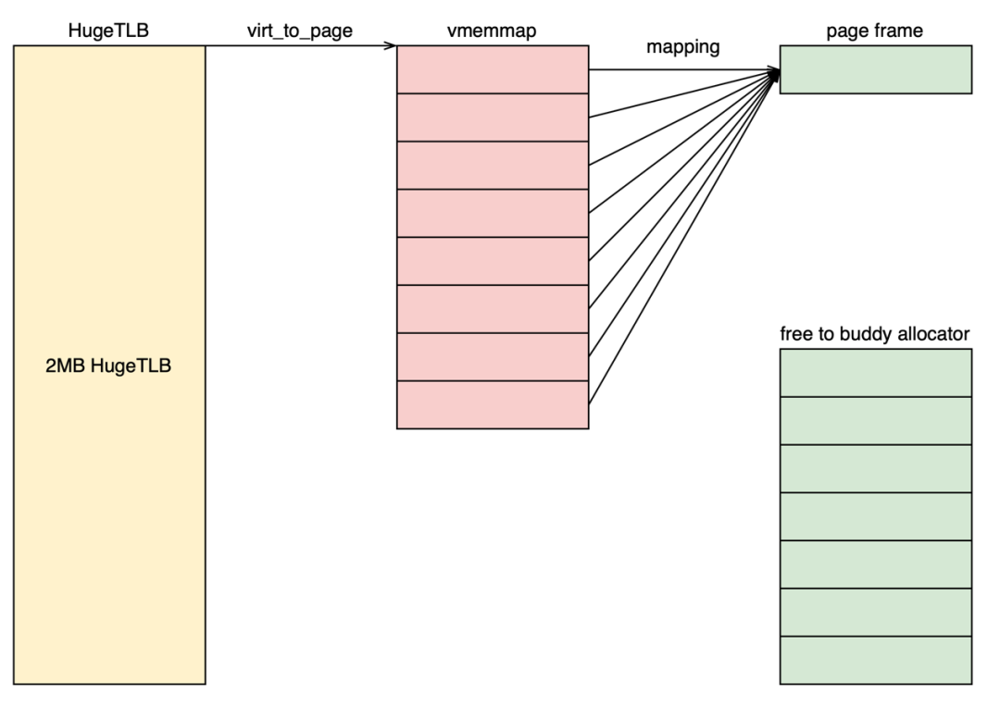

# 针对HugeTLB的内存节省

## 背景介绍

内存是计算机中十分昂贵且稀缺的资源。在Linux Kernel中，内存以页为基本单位进行管理，页的默认大小为4KB，Linux为每个页都分配了对应的管理结构**struct page**，其大小通常为64B，即需要总内存的1/64用于内存管理。

针对HugeTLB大页，由于其所有子页会作为一个整体进行分配和使用，因此并不需要为其每个子页都分配struct page，即存在着内存浪费。本特性就是在使用HugeTLB大页的场景下，通过释放冗余的struct page，从而实现内存节省。

## 特性概述

本特性是由宋牧春团队开发并贡献至Linux Kernel社区的优化特性。作为开源特性被回合至openEuler社区。该特性通过释放冗余的struct page结构体，节省非必要的内存占用，降低内存成本，在使用HugeTLB大页的场景，内存收益最高可达到HugeTLB大页内存总量的1.4%~1.6%。

## 原理介绍

在Linux Kernel中，页的默认大小为4KB，而HugeTLB大页一般有2MB和1GB两种大小，即每个HugeTLB大页由512个或262144个连续页组成。
以2M的HugeTLB大页举例，如图1所示，一个2M的HugeTLB大页需要512个struct page结构，占用32KB，即8个页。

图1. page与struct page映射关系

而这些struct page中并非所有字段都是有用的信息，如图2所示，前两个struct page中含有重要的管理信息，但从第3个页开始，每个struct page的内容都是重复的。因此，我们实际上并不需要512个struct page结构，只需要3个就足够了。

图2. struct page中的关系信息

由于每个页可以容纳64个struct，因此3个struct page只需要1个页就足够了，后7个页是冗余的。因此可以将图1中HugeTLB对应的后7个页的vmemmap虚拟地址全部映射到第1个vmemmap对应的物理页帧，然后释放后7个页，如图3所示。

图3. 优化后的page与struct page映射关系

## 内存收益与性能影响

### 内存收益

在使用2MB的HugeTLB大页时，内存收益约为HugeTLB内存总量的1.4%；在使用1GB的HugeTLB大页时，内存收益约为HugeTLB内存总量的1.6%。表1为不同内存规格下的收益情况。

| Total Size of HugeTLB Page | HugeTLB Type | Memory Gain |
| -------------------------- | ------------ | ----------- |
| 512GB                      | 2MB          | ~7GB        |
| 1TB                        | 2MB          | ~14GB       |
| 512GB                      | 1GB          | ~8GB        |
| 1TB                        | 1GB          | ~16GB       |

表1. 不同规格下内存节省收益

### 性能影响

HugeTLB的使用方法一般是先预留后使用，其中预留大页的速度下降约3~4倍左右。

在访问HugeTLB大页时，由于vmemmap区域需要从块映射修改为页映射，会多访问一级页表，但由于有TLB缓存，因此性能损失并不大。

同时，由于减少了struct page，访问struct page的cache命中率会提高，对HugeTLB大页执行get_user_page操作的性能会提升接近4倍。

## 总结

本特性通过释放冗余的struct page结构体，节省非必要的内存占用，对于大内存的服务器场景，可有效的降低内存成本。

## 参考文档

1. [Free some vmemmap pages of HugeTLB page](https://lwn.net/Articles/855910/)
2. [围绕 HugeTLB 的极致优化](https://zhuanlan.zhihu.com/p/392703566)
