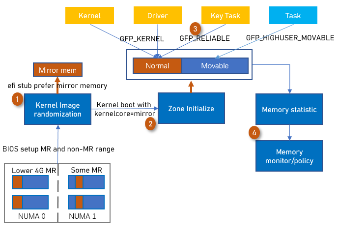

# 为什么需要内存可靠性分级提升系统可靠性

随着内存条容量和频率的提升，对工艺的要求越来越高，随着工艺的不断提升，带来的内存失效风险也越大。如制程缩小导致脏污残留影响变大，信号裕量减少，眼高变小，兼容性问题变多。包括工艺从20纳米提升到15+纳米，出现CE错误的概率由1%上升到7%，而从15+纳米提升到10纳米左右，则在颗粒生命周期内出现CE的概率几乎为100%。

另外，伴随着AEP等新型介质的引入，CPU为了支持这些新介质，基于现有内存数据结构情况下，纠错能力有明显下降。以X86为例，Ivy bridge内存中每256bit会有16bit CRC纠错，而在grantley，占用1位用于标记外设错误数据(posion)，导致只有15bit CRC用于纠错。在purley代次，因为AEP介质的引入，又占用1位用于标识AEP介质，最终导致每256bit只有14bit用于纠错，纠错能力大大下降。
本特性基于镜像内存技术，将内核、tmpfs、pagecache、关键用户态进程使用的内存放入镜像内存中，降低内存故障对于业务的影响。

## 什么是镜像内存和内存可靠性分级

镜像内存核心依赖硬件内存控制器，硬件上类似硬盘的RAID1， 一份数据存两遍，如果单根内存发生了UCE，内存控制器就会从镜像区域重新同步一份过来，避免UCE问题。
系统中存在镜像内存时且kernelcore相关启动参数被配置时，系统会将镜像内存初始化到Normal Zone而普通内存初始化到Movable Zone，内核、驱动由于默认使用Normal Zone内存（镜像内存），从而降低了系统因为UCE挂死的概率。
内存可靠性分级是基于不同业务发行内存失效对于系统的影响从而将使用者固定到镜像、普通内存中，从而降低内存失效对于整体系统的影响，提升可靠性。对于全镜像方案可以提升内存的利用率，解决了tmpfs、pagecache、用户态进程无法使用镜像内存的问题。
由于用户态的tmpfs、pagecache触发问题，也会导致内核挂死，因此也使这两部分使用镜像内存。
用户可以识别出关键的用户态进程，如果该进程发生UCE对于功能性能大、进程使用内存可控，那么也可以使用镜像内存以避免内存失效对业务的影响。

## 如何实现内存可靠性分级

‍

图1. 内存可靠性分级原理

普通内存可以泛化为低可靠内存，镜像内存可以泛化为高可靠内存。

本技术的核心是根据不同类型的业务分配不同可靠性属性的内存。由于内存按照高低可靠性分为两段，因此内存的申请和释放也按照高低可靠来进行分开管理。操作系统控制内存申请路径，用户态进程使用低可靠内存，内核等关键业务场景使用高可靠内存。当高可靠内存不足时，系统应该能够 fallback 到低可靠区申请或者直接申请失败。

同时，对于进程的部分内存段的可靠性需求或者整个进程申请的内存，也支持按需申请高可靠内存。例如，可以指定关键进程使用高可靠内存，以减少关键进程遇到内存错误的概率。目前默认内核使用的都是高可靠内存，用户态进程使用的都是低可靠内存，这会造成一些关键或者核心服务的不稳定。因此，需要对这些关键服务进行特殊处理，使其使用高可靠内存，以提高关键进程的运行稳定性。

在系统遇到内存错误时，操作系统应该对未分配的低可靠内存进行覆盖写，以清除未发现的内存错误。

为了达成按照上层业务指定高可靠内存的申请的逻辑，系统新增了 GFP_RELIABLE 标志来指定申请高可靠内存。

## 实际价值是什么

1. 降低内存故障对于业务的影响
2. 在系统整体可靠性不下降的前提下节省内存

‍
