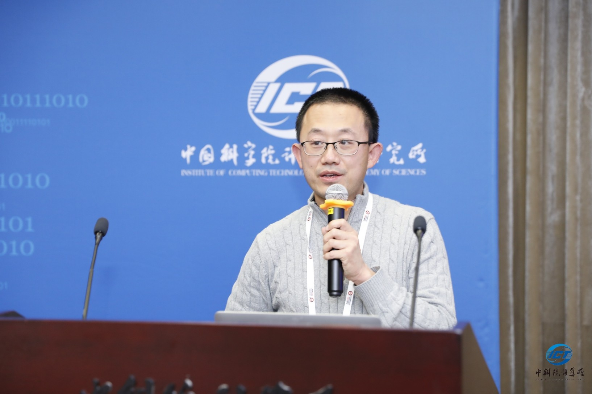

openEuler kernel 技术分享-第 2 期

《从 ARM 和 RISC-V 架构看体系结构对 Linux 操作系统的支持》

# 1 培训课程简介
-------

openEuler 支持了当今主流三大架构，X86，ARM和RISC-V，当我们说操作系统支持了某个架构时在说什么？是否仅仅是 kernel，libc 和编译器的工作，还有什么重要又容易被遗忘的地方？

讲者张健，将以 ARM64 和 RISC-V 为例，从自顶向下和自底向上两个方向，从异常处理，内存，安全，电源管理等角度，例说它们对 Linux 发行版的支持。

# 2 培训讲师介绍
-------

主讲人：
张健
先后在 SUSE，华为，创业公司工作，任架构师和技术合伙人等职位，在ARM架构上有 13 年的软件积累。去年在开始投入 RISC-V 架构，曾在 os2atc 2020 介绍 RISC-V 对于 Linux 的支持。

时间：
2021年4月2日 14:00（本周五下午2点）

主办：
openEuler kernel SIG

培训链接：
https://welink-meeting.zoom.us/j/170346906

# 3 关于 openEuler kernel 技术分享
-------

openEuler kernel SIG 会持续规划一些技术议题，欢迎正在阅读的你一起加入，分享与探讨内核技术。

本期特别感谢张健同学为我们带来的分享。

openEuler kernel 源代码仓库：

https://gitee.com/openeuler/kernel

欢迎大家多多 Star，多多参与社区开发，多多贡献补丁。

# 4 往期回顾
-------

openEuler kernel 技术分享 - 第 1 期 -- kdump 基本原理、使用及案例介绍

https://www.bilibili.com/video/BV1M64y1Q7yp

# 5 关于 openEuler kernel SIG
-------

添加管理员微信 "openeuler-kernel"

备注 "交流群"

加入 openEuler kernel SIG 技术交流群